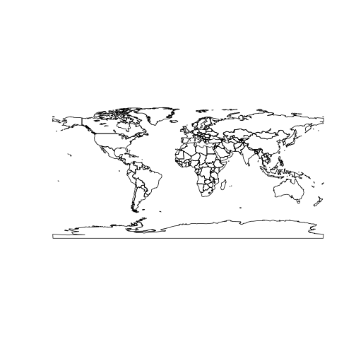

# gisfao


`gisfao` package provides you with the up-to-data shapefiles that are compatible with [FAOSTAT](http://faostat.fao.org/) country codes (`FAO_CODE`). Also, shapefiles data slots have a dummy variable for each FAO regions which you can subset the shapefile with. Fao regions are:

- RAF (Africa)
- LAC (Latin America and the Caribbean)
- RAP (Asia and the Pacific)
- REU (Europe and Central Asia)
- RNE (Near East and North Africa)

Shapefiles included

1. **World Country Polygons** `fao_world` - class `SpatialPolygonDataFRame`
2. **World Country Polygons Centroids** `fao_world_centroids` - class `SpatialPointDataFRame`

See vignette at **<https://github.com/muuankarski/gisfao/blob/master/vignettes/gisfao_vignette.md>** for more detailed examples.

<!--
There are no function  only one function `load_fao_shape` that requires one attribute `region` that accept the fao regions as values. Default is `world` that returns the shapefile as whole.
-->


## Install packages


```r
devtools::install_github('muuankarski/gisfao')
```


## Load and plot the polygon data


```r
library(sp)
data(fao_world)
plot(fao_world)
```

 

```r
data(fao_world_centroids)
plot(fao_world_centroids)
```

 

```r
data(graticule)
plot(graticule)
```

 
