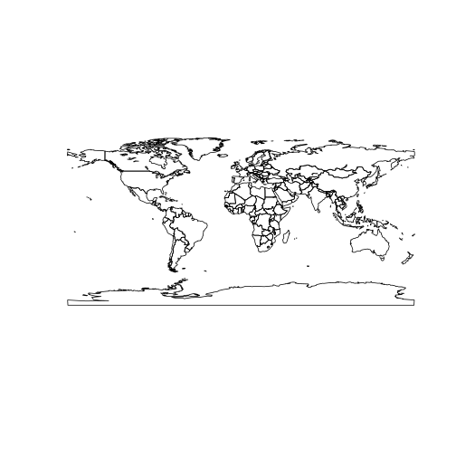

`faogis` package provides you with the up-to-data shapefiles that are compatible with [FAOSTAT](http://faostat.fao.org/) country codes (`FAO_CODE`). Also, shapefiles data slots have a dummy variable for each FAO regions which you can subset the shapefile with. Fao regions are:

- RAF (Africa)
- LAC (Latin America and the Caribbean)
- RAP (Asia and the Pacific)
- REU (Europe and Central Asia)
- RNE (Near East and North Africa)

Shapefiles included

1. **World Country Polygons** `fao_world` - class `SpatialPolygonDataFRame`
2. **World Country Polygons Centroids** `fao_world_centroids` - class `SpatialPointDataFRame`

<!--
There are no function  only one function `load_fao_shape` that requires one attribute `region` that accept the fao regions as values. Default is `world` that returns the shapefile as whole.
-->


## Install packages


```r
devtools::install_github('muuankarski/gisfao')
```


## Load and plot the polygon data


```r
library(sp)
data(fao_world)
plot(fao_world)
```

 


### Subset the data


```r
shape <- fao_world[which(fao_world[["RNE"]] == TRUE),]
plot(shape)
```

 


### Plot with ggplot2


```r
shape <- fao_world[which(fao_world[["RNE"]] == TRUE),]
library(ggplot2)
map.df <- fortify(shape)
```

```
## Regions defined for each Polygons
```

```r
p <- ggplot()
p <- p + geom_polygon(data=map.df,aes(long,lat,group=group), 
                      fill="Firebrick", color="white", size=.5, alpha=.5)
p
```

 

### Plot with ggplot2 using Robinson projection


```r
library(rgdal)
shape <- spTransform(fao_world, CRS("+proj=robin"))
library(ggplot2)
map.df <- fortify(shape)
```

```
## Regions defined for each Polygons
```

```r
p <- ggplot()
p <- p + geom_polygon(data=map.df,aes(long,lat,group=group), 
                      fill="Firebrick", color="white", size=.5, alpha=.5)
p
```

 


## Load and plot the point data


```r
library(sp)
data(fao_world_centroids)
plot(fao_world_centroids)
```

 


### Subset the data


```r
shape <- fao_world_centroids[which(fao_world_centroids[["RNE"]] == TRUE),]
plot(shape)
```

 

ADM0_NAME
### Plot with ggplot2


```r
shape <- fao_world_centroids[which(fao_world_centroids[["RNE"]] == TRUE),]
# fortify the SpatialPointsDataFrame
points <- cbind(coordinates(shape), shape@data)

names(points)[names(points)=="x"] <- "long"
names(points)[names(points)=="y"] <- "lat"

library(ggplot2)
p <- ggplot()
p <- p + geom_point(data=points,aes(long,lat), color="Firebrick", size=3, color="Firebrick")
p
```

 

### Plot the polygons and points with ggplot2 using Robinson projection


```r
library(rgdal)
# Set new robinson projection for both data
shape <- spTransform(fao_world, CRS("+proj=robin"))
points <- spTransform(fao_world_centroids, CRS("+proj=robin"))
# Fortify both data
map.df <- fortify(shape)
```

```
## Regions defined for each Polygons
```

```r
points.df <- cbind(coordinates(points), points@data)
names(points.df)[names(points.df)=="x"] <- "long"
names(points.df)[names(points.df)=="y"] <- "lat"

p <- ggplot()
p <- p + geom_polygon(data=map.df,aes(long,lat,group=group), 
                      fill="Firebrick", color="white", size=.5, alpha=.5)
p <- p + geom_point(data=points.df,aes(long,lat), color="Firebrick", size=3, color="Firebrick")
p <- p + geom_text(data=points.df,aes(long,lat,label=ADM0_NAME), color="Dim Grey", size=3)
p
```

 

