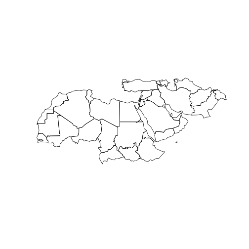

`faogis` package provides you with the up-to-data shapefile that is compatible with [FAOSTAT](http://faostat.fao.org/) country codes (`FAO_CODE`). Also, shapefile data slot has a dummy variable for each FAO regions which you can subset while loading the shapefile. Fao regions are:

- RAF (Africa)
- LAC (Latin America and the Caribbean)
- RAP (Asia and the Pacific)
- REU (Europe and Central Asia)
- RNE (Near East and North Africa)

There is only one function `load_fao_shape` that requires one attribute `region` that accept the fao regions as values. Default is `world` that returns the shapefile as whole.

## Install packages


```r
devtools::install_github('muuankarski/gisfao')
```


## Load the shapefile


```r
library(gisfao)
library(sp)
shape <- load_fao_shape()
plot(shape)
```

 


## Subset the shapefile


```r
RNE <- load_fao_shape(region = "RNE")
plot(RNE)
```

 

or 


```r
world <- load_fao_shape(region = "world")
RNE <- fao_world[which(fao_world[["RNE"]] == TRUE),]
plot(RNE)
```

 


