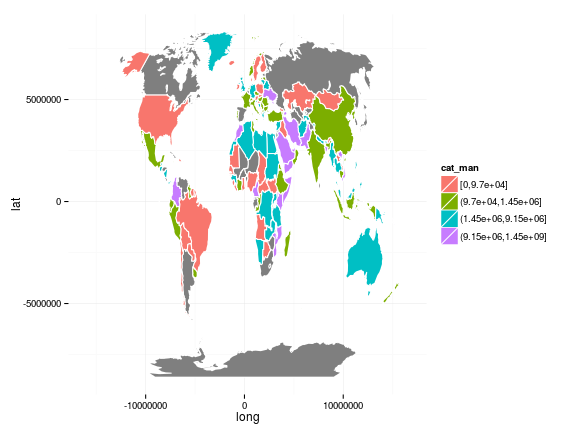
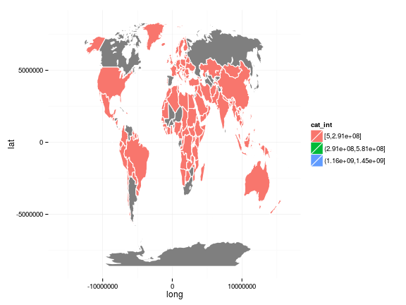
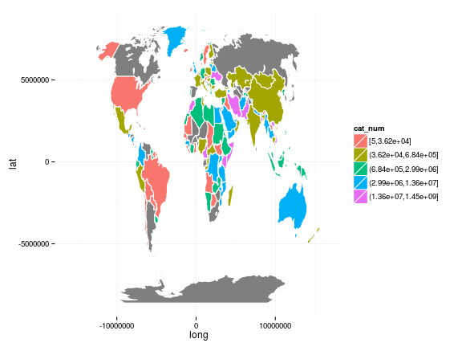
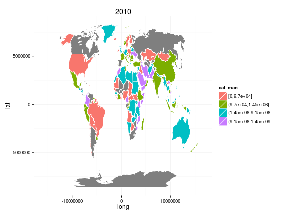

# Intro

In this experiment we will download .csv data from FAOSTAT and create a simple choropleth maps using ggplot2.


# Downloading data from FAOSTAT

In this example we are not using the FAOSTAT API for downloading the data, but we download the [Live Animals data through bulk download](http://faostat3.fao.org/download/Q/QA/E) link as below.


```r
download.file("http://faostat3.fao.org/faostat-bulkdownloads/Production_Livestock_E_All_Data_(Norm).zip",destfile = "bulk.zip")
unzip("bulk.zip")
dat <- read.csv("Production_Livestock_E_All_Data_(Norm).csv", stringsAsFactors = FALSE)
```

Once downloaded we use the `dplyr`-package to subset the number of cattle for years 2000, 2005 and 2010


```r
library(dplyr)
d <- dat %>% 
  filter(Item == "Cattle", Unit == "Head", Year %in% c(2000,2005,2010)) %>% # filtering the rows
  select(Country.Code,Year,Value) %>% # selecting the columns
  rename(FAOST_CODE = Country.Code) # renaming the var
knitr::kable(head(d)) # showing the first 6 rows of the data
```


| FAOST_CODE| Year|   Value|
|----------:|----:|-------:|
|          2| 2000| 2900000|
|          2| 2005| 3723000|
|          2| 2010| 5673000|
|          3| 2000|  728000|
|          3| 2005|  655000|
|          3| 2010|  493000|

Then we classify the data manually also using `dplyr`-package


```r
library(dplyr)
d <- d %>% mutate(cat_man = cut(Value, breaks=c(0, 97040, 1452000, 9149000, 1453000000), include.lowest=TRUE), # cut manually
                  cat_int = ggplot2::cut_interval(Value,n = 5), # cut into 5 equally interval
                  cat_num = ggplot2::cut_number(Value, n = 5)) # cut into 
knitr::kable(head(d)) # showing the first 6 rows of the data
```


| FAOST_CODE| Year|   Value|cat_man             |cat_int      |cat_num             |
|----------:|----:|-------:|:-------------------|:------------|:-------------------|
|          2| 2000| 2900000|(1.45e+06,9.15e+06] |[5,2.91e+08] |(6.84e+05,2.99e+06] |
|          2| 2005| 3723000|(1.45e+06,9.15e+06] |[5,2.91e+08] |(2.99e+06,1.36e+07] |
|          2| 2010| 5673000|(1.45e+06,9.15e+06] |[5,2.91e+08] |(2.99e+06,1.36e+07] |
|          3| 2000|  728000|(9.7e+04,1.45e+06]  |[5,2.91e+08] |(6.84e+05,2.99e+06] |
|          3| 2005|  655000|(9.7e+04,1.45e+06]  |[5,2.91e+08] |(3.62e+04,6.84e+05] |
|          3| 2010|  493000|(9.7e+04,1.45e+06]  |[5,2.91e+08] |(3.62e+04,6.84e+05] |


# Manipulating the spatial data

For simplicity we will first fortify the `SpatialPolygonDataFrame` into `data.frame` and merge it with the attribute data from FAOSTAT only thereafter. **However, I strongly advice to use approach in the `gisfao_vignette.Rmd` that uses the proper spatial data types and methods. It is good to remember tha you can't go back into spatial data classes from normal data.frame meaning that the following operations are irreversible!**


```r
library(gisfao)
library(rgdal)
library(ggplot2)
shape <- spTransform(fao_world, CRS("+proj=robin"))
map.df <- fortify(shape)
```


Merge the map.df with the FAOSTAT data


```r
map.df <- merge(map.df,d,by.x="id", by.y="FAOST_CODE",all=TRUE)
map.df <- arrange(map.df, order)
```


# Create maps

## Using each of three category variables and year 2010

Using `cut`


```r
plot_data <- map.df %>% filter(Year == 2010)

p <- ggplot()
p <- p + geom_polygon(data=map.df,aes(long,lat,group=group,fill=cat_man), 
                      color="white", size=.5)
p <- p + theme_minimal()
p
```

 

Using `cut_interval`


```r
plot_data <- map.df %>% filter(Year == 2010)

p <- ggplot()
p <- p + geom_polygon(data=map.df,aes(long,lat,group=group,fill=cat_int), 
                      color="white", size=.5)
p <- p + theme_minimal()
p
```

 

Using `cut_number`


```r
plot_data <- map.df %>% filter(Year == 2010)

p <- ggplot()
p <- p + geom_polygon(data=map.df,aes(long,lat,group=group,fill=cat_num), 
                      color="white", size=.5)
p <- p + theme_minimal()
p
```

 


## Looping over the three years


```r
for (y in c(2000,2005,2010)){
  plot_data <- map.df %>% filter(Year == 2010)

  p <- ggplot()
  p <- p + geom_polygon(data=map.df,aes(long,lat,group=group,fill=cat_man), 
                      color="white", size=.5)
  p <- p + theme_minimal()
  p <- p + labs(title = y)
  print(p)
}
```

   


# Further references

For cleaning up the labels etc. and styling your maps you can have a look at these scripts from Yearbook process:

- [map_categories.R](https://github.com/UNFAOstatistics/regional15/blob/master/input/code/plot/map_categories.R) 
- [create_map_here.R](https://github.com/UNFAOstatistics/regional15/blob/master/input/code/plot/create_map_here.R)


