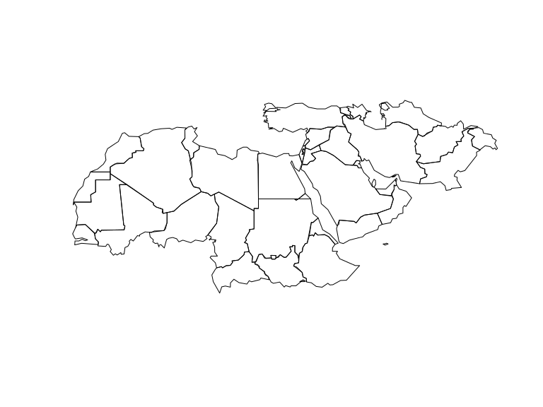
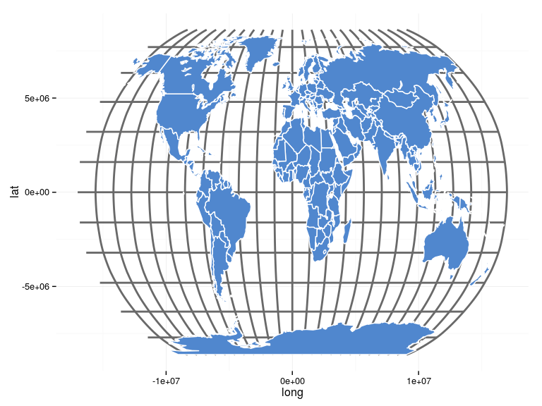
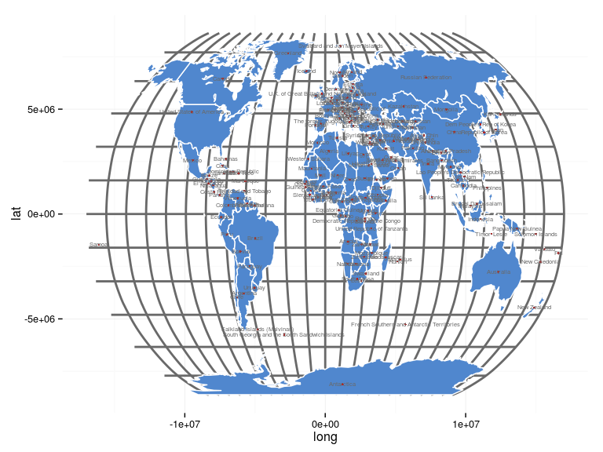
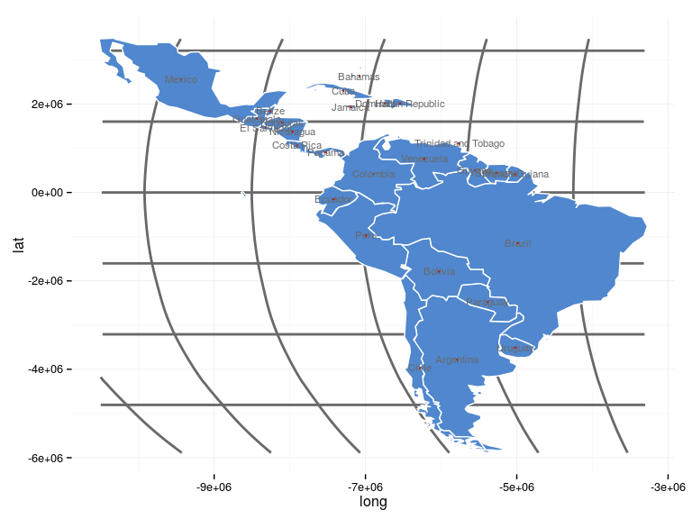
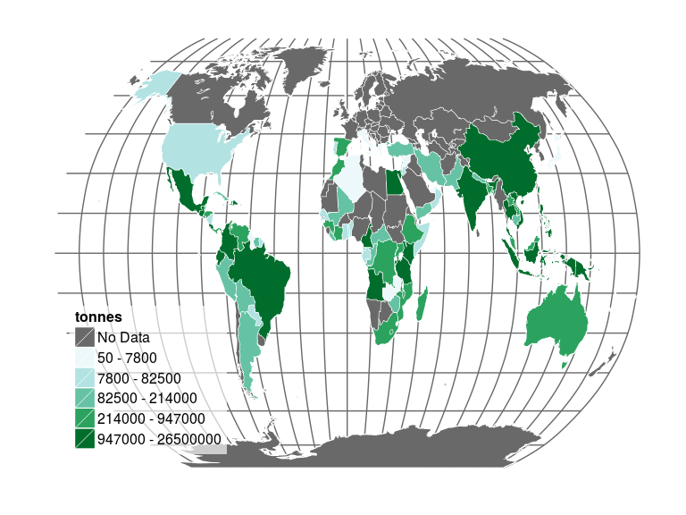

`faogis` package provides you with the up-to-data shapefiles that are compatible with [FAOSTAT](http://faostat.fao.org/) country codes (`FAOST_CODE`). Also, shapefiles data slots have a dummy variable for each FAO regions which you can subset the shapefile with. Fao regions are:

- RAF (Africa)
- LAC (Latin America and the Caribbean)
- RAP (Asia and the Pacific)
- REU (Europe and Central Asia)
- RNE (Near East and North Africa)

Shapefiles included

1. **World Country Polygons** `fao_world` - class `SpatialPolygonDataFRame`
2. **World Country Polygons Centroids** `fao_world_centroids` - class `SpatialPointDataFRame`

<!--
There are no function  only one function `load_fao_shape` that requires one attribute `region` that accept the fao regions as values. Default is `world` that returns the shapefile as whole.
-->


## Install packages


```r
devtools::install_github('UNFAOstatistics/gisfao')
```


## Load and plot each of the file


```r
library(gisfao)
library(sp)
data(fao_world)
plot(fao_world)
```

 

```r
data(fao_world_centroids)
plot(fao_world_centroids)
```

 

```r
data(graticule)
plot(graticule)
```

 


### Subset the data


```r
shape <- fao_world[which(fao_world[["RNE"]] == TRUE),]
plot(shape)
```

 

```r
shape <- fao_world[which(fao_world[["LAC"]] == TRUE),]
plot(shape)
```

 

****

## Plot a World Map in ggplot2 using Robinson projection

### First the polygon


```r
library(rgdal)
library(ggplot2)
shape <- spTransform(fao_world, CRS("+proj=robin"))
map.df <- fortify(shape)
p <- ggplot()
p <- p + geom_polygon(data=map.df,aes(long,lat,group=group), 
                      fill="#5087CE", color="white", size=.5)
p
```

 


### Add the graticule below the landmass


```r
data(graticule)
grat_robin <- spTransform(graticule, CRS("+proj=robin"))  # reproject graticule
grat_df_robin <- fortify(grat_robin)

p <- ggplot()
p <- p + geom_path(data = grat_df_robin, 
                   aes(long, lat, group = group, fill = NULL), 
                   linetype = "solid", color = "Dim Grey", size = 1)
p <- p + geom_polygon(data=map.df,aes(long,lat,group=group), 
                      fill="#5087CE", color="white", size=.5)
p <- p + theme_minimal()
p
```

 


### Add the polygon centroids and country names


```r
library(rgdal)
# Set new robinson projection for both data
points <- spTransform(fao_world_centroids, CRS("+proj=robin"))
# Fortify both data
points.df <- cbind(coordinates(points), points@data)
names(points.df)[names(points.df)=="x"] <- "long"
names(points.df)[names(points.df)=="y"] <- "lat"

p <- p + geom_point(data=points.df,aes(long,lat), color="Firebrick", size=1, color="#5087CE")
p <- p + geom_text(data=points.df,aes(long,lat,label=ADM0_NAME), color="Dim Grey", size=2)
p
```

 

****

## Plot a Latin America and the Caribbean map

### First the polygon


```r
library(rgdal)
library(ggplot2)
shape <- fao_world[which(fao_world[["LAC"]] == TRUE),]
shape <- spTransform(shape, CRS("+proj=robin"))
map.df <- fortify(shape)
p <- ggplot()
p <- p + geom_polygon(data=map.df,aes(long,lat,group=group), 
                      fill="#5087CE", color="white", size=.5)
p
```

 


### Add the graticule below the landmass


```r
data(graticule)
grat_robin <- spTransform(graticule, CRS("+proj=robin"))  # reproject graticule
gr_rob <- fortify(grat_robin)

# crop the grid
gr_rob <- gr_rob[gr_rob$lat >= min(map.df$lat) & gr_rob$lat <= max(map.df$lat),]
gr_rob <- gr_rob[gr_rob$long >= min(map.df$long) & gr_rob$long <= max(map.df$long),]

p <- ggplot()
p <- p + geom_path(data = gr_rob, 
                   aes(long, lat, group = group, fill = NULL), 
                   linetype = "solid", color = "Dim Grey", size = 1)
p <- p + geom_polygon(data=map.df,aes(long,lat,group=group), 
                      fill="#5087CE", color="white", size=.5)
p <- p + theme_minimal()
p
```

 


### Add the polygon centroids


```r
library(rgdal)
library(rgeos)
centroids <- fao_world_centroids[which(fao_world_centroids[["LAC"]] == TRUE),]
# fortify the SpatialPointsDataFrame
centroids <- spTransform(centroids, CRS("+proj=robin"))
points.df <- cbind(coordinates(centroids), centroids@data)

names(points.df)[names(points.df)=="x"] <- "long"
names(points.df)[names(points.df)=="y"] <- "lat"

library(ggplot2)

p <- p + geom_point(data=points.df,aes(long,lat), color="Firebrick", size=1, color="#5087CE")
p <- p + geom_text(data=points.df,aes(long,lat,label=ADM0_NAME), color="Dim Grey", size=3)
p
```

 


****

## Choropleth map using FAOSTAT data

Download the data from FAOSTAT using [`FAOSTAT`]()-package


```r
require(devtools)
if (!"FAOSTAT" %in% installed.packages()) {
  install_github(username = "mkao006", repo = "FAOSTATpackage",
                 ref = "master", subdir = "FAOSTAT")
}
require(FAOSTAT)
# Download data
dat <- getFAOtoSYB(domainCode = "QC", 
                   elementCode = 5510,
                   itemCode = 486,
                   yearRange = 2012:2012)
```

```
## 
## 
##                  ----------------------------------------                 
##                  ** FAOSTAT Data Download (1 in Total) **                 
##                  ----------------------------------------                 
## 
## (1): Downloading variable QC_486_5510 ... [1] 1
## 
## NOTE: Multiple China detected in 'Value' sanitization is performed
## OK
## 
##  Number of variables successfully downloaded: 1 out of 1
```

```r
dat <- dat[["entity"]]
```

Create a `categories`-function for setting breaks and polishing the labels.


```r
# Creating a custom function for creating the breaks and makeing them look neat
categories <- function(x, cat=5) {
  
  library(stringr)
  levs <- as.data.frame(as.character(levels(cut_number(x, cat))))
  names(levs) <- "orig"
  levs$mod <- str_replace_all(levs$orig, "\\[", "")
  levs$mod <- str_replace_all(levs$mod, "\\]", "")
  levs$mod <- str_replace_all(levs$mod, "\\(", "")
  levs$lower <- gsub(",.*$","", levs$mod)
  levs$upper <- gsub(".*,","", levs$mod)
  
  levs$lower <- factor(levs$lower)
  levs$lower <- round(as.numeric(levels(levs$lower))[levs$lower],0)
  
  levs$upper <- factor(levs$upper)
  levs$upper <- round(as.numeric(levels(levs$upper))[levs$upper],0)
  
  levs$labs <- paste(levs$lower,levs$upper, sep=" - ")
  
  labs <- as.character(c(levs$labs))
  y <- cut_number(x, cat, right = FALSE, labels = labs)
  y <- as.character(y)
  y[is.na(y)] <- "No Data"
  y <- factor(y, levels=c("No Data",labs[1:cat]))
}
```


Make the shape and the attribute data of same lenght and merge them together with `spCbind`, and apply the `categories`-function to banana production quantities for creating the categories for plotting.


```r
# set Robinson projection
shape <- spTransform(fao_world, CRS("+proj=robin"))
dim(shape)
```

```
## [1] 187  19
```

```r
dim(dat)
```

```
## [1] 137   3
```

```r
# Spatial dataframe has 187 rows and attribute data 137.  We need to make
# attribute data to have similar number of rows
FAOST_CODE <- as.character(shape$FAOST_CODE)
VarX <- rep(NA, 187)
df.d <- data.frame(FAOST_CODE, VarX)
# then we shall merge this with Eurostat data.frame
dat2 <- merge(dat, df.d, by.x = "FAOST_CODE", all.y = TRUE)
## merge this manipulated attribute data with the spatialpolygondataframe
## rownames
row.names(dat2) <- dat2$FAOST_CODE
row.names(shape) <- as.character(shape$FAO_CODE)
## order data
dat2 <- dat2[order(row.names(dat2)), ]
shape <- shape[order(row.names(shape)), ]
## join
library(maptools)
shape2 <- spCbind(shape, dat2)
# Apply the categories-function
shape2$value_cat <- categories(shape2$QC_486_5510)
```

Fortify the shapefile for ggplot2-plotting


```r
# Fortify the shape with the attribute data
shape2$id <- rownames(shape2@data)
map.points <- fortify(shape2, region = "id")
map.df <- merge(map.points, shape2, by = "id")
```

Create the plot with Robinson projection and underlying grid. See the [Color palette](http://colorbrewer2.org/?type=sequential&scheme=BuGn&n=5)


```r
library(scales)
library(grid)
# graticule
grat_robin <- spTransform(graticule, CRS("+proj=robin"))  # reproject graticule
grat_df_robin <- fortify(grat_robin)
# Create the plot
p <- ggplot(data=map.df, aes(long,lat,group=group))
# Grey for the non-data regions
p <- p + geom_path(data = grat_df_robin, aes(long, lat, group = group, fill = NULL), linetype = "solid", color = "Dim Grey", size = .5)
p <- p + geom_polygon(data = map.df, aes(long,lat),fill=NA,colour="white",size = .7)
p <- p + geom_polygon(aes(fill = value_cat),colour="white",size=.2)
p <- p + scale_fill_manual(values=c("Dim Grey","#edf8fb","#b2e2e2","#66c2a4","#2ca25f","#006d2c")) 
p <- p + theme(legend.position = c(0.05,0.05), 
                          legend.justification=c(0,0),
                          legend.key.size=unit(6,'mm'),
                          legend.direction = "vertical",
                          legend.background=element_rect(colour=NA, fill=alpha("white", 2/3)),
                          legend.text=element_text(size=12), 
                          legend.title=element_text(size=12), 
                          title=element_text(size=16), 
                          panel.background = element_blank(), 
                          plot.background = element_blank(),
                          panel.grid.minor = element_blank(),
                          panel.grid.major = element_blank(),
                          axis.text = element_blank(), 
                          axis.title = element_blank(), 
                          axis.ticks = element_blank())
p <- p + guides(fill = guide_legend(title = "tonnes",
                                     title.position = "top", 
                                     title.hjust=0))
p
```

 

