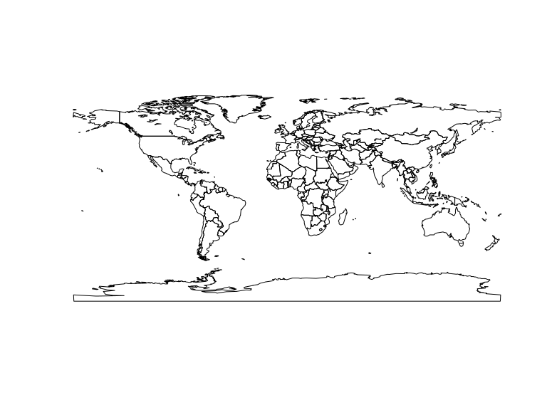

`faogis` package provides you with the up-to-data shapefiles that are compatible with [FAOSTAT](http://faostat.fao.org/) country codes (`FAO_CODE`). Also, shapefiles data slots have a dummy variable for each FAO regions which you can subset the shapefile with. Fao regions are:

- RAF (Africa)
- LAC (Latin America and the Caribbean)
- RAP (Asia and the Pacific)
- REU (Europe and Central Asia)
- RNE (Near East and North Africa)

Shapefiles included

1. **World Country Polygons** `fao_world` - class `SpatialPolygonDataFRame`
2. **World Country Polygons Centroids** `fao_world_centroids` - class `SpatialPointDataFRame`

<!--
There are no function  only one function `load_fao_shape` that requires one attribute `region` that accept the fao regions as values. Default is `world` that returns the shapefile as whole.
-->


## Install packages


```r
devtools::install_github('muuankarski/gisfao')
```


## Load and plot each of the file


```r
library(gisfao)
library(sp)
data(fao_world)
plot(fao_world)
```

 

```r
data(fao_world_centroids)
plot(fao_world_centroids)
```

 

```r
data(graticule)
plot(graticule)
```

 


### Subset the data


```r
shape <- fao_world[which(fao_world[["RNE"]] == TRUE),]
plot(shape)
```

 

```r
shape <- fao_world[which(fao_world[["LAC"]] == TRUE),]
plot(shape)
```

 


## Plot a World Map in ggplot2 using Robinson projection

### First the polygon


```r
library(rgdal)
library(ggplot2)
shape <- spTransform(fao_world, CRS("+proj=robin"))
map.df <- fortify(shape)
p <- ggplot()
p <- p + geom_polygon(data=map.df,aes(long,lat,group=group), 
                      fill="#5087CE", color="white", size=.5)
p
```

 


### Add the graticule below the landmass


```r
data(graticule)
grat_robin <- spTransform(graticule, CRS("+proj=robin"))  # reproject graticule
grat_df_robin <- fortify(grat_robin)

p <- ggplot()
p <- p + geom_path(data = grat_df_robin, 
                   aes(long, lat, group = group, fill = NULL), 
                   linetype = "solid", color = "Dim Grey", size = 1)
p <- p + geom_polygon(data=map.df,aes(long,lat,group=group), 
                      fill="#5087CE", color="white", size=.5)
p <- p + theme_minimal()
p
```

 


### Add the polygon centroids and country names


```r
library(rgdal)
# Set new robinson projection for both data
points <- spTransform(fao_world_centroids, CRS("+proj=robin"))
# Fortify both data
points.df <- cbind(coordinates(points), points@data)
names(points.df)[names(points.df)=="x"] <- "long"
names(points.df)[names(points.df)=="y"] <- "lat"

p <- p + geom_point(data=points.df,aes(long,lat), color="Firebrick", size=1, color="#5087CE")
p <- p + geom_text(data=points.df,aes(long,lat,label=ADM0_NAME), color="Dim Grey", size=2)
p
```

 


## Plot a Latin America and the Caribbean map

### First the polygon


```r
library(rgdal)
library(ggplot2)
shape <- fao_world[which(fao_world[["LAC"]] == TRUE),]
shape <- spTransform(shape, CRS("+proj=robin"))
map.df <- fortify(shape)
p <- ggplot()
p <- p + geom_polygon(data=map.df,aes(long,lat,group=group), 
                      fill="#5087CE", color="white", size=.5)
p
```

 


### Add the graticule below the landmass


```r
data(graticule)
grat_robin <- spTransform(graticule, CRS("+proj=robin"))  # reproject graticule
gr_rob <- fortify(grat_robin)

# crop the grid
gr_rob <- gr_rob[gr_rob$lat >= min(map.df$lat) & gr_rob$lat <= max(map.df$lat),]
gr_rob <- gr_rob[gr_rob$long >= min(map.df$long) & gr_rob$long <= max(map.df$long),]

p <- ggplot()
p <- p + geom_path(data = gr_rob, 
                   aes(long, lat, group = group, fill = NULL), 
                   linetype = "solid", color = "Dim Grey", size = 1)
p <- p + geom_polygon(data=map.df,aes(long,lat,group=group), 
                      fill="#5087CE", color="white", size=.5)
p <- p + theme_minimal()
p
```

 


### Add the polygon centroids


```r
library(rgdal)
library(rgeos)
centroids <- fao_world_centroids[which(fao_world_centroids[["LAC"]] == TRUE),]
# fortify the SpatialPointsDataFrame
centroids <- spTransform(centroids, CRS("+proj=robin"))
points.df <- cbind(coordinates(centroids), centroids@data)

names(points.df)[names(points.df)=="x"] <- "long"
names(points.df)[names(points.df)=="y"] <- "lat"

library(ggplot2)

p <- p + geom_point(data=points.df,aes(long,lat), color="Firebrick", size=1, color="#5087CE")
p <- p + geom_text(data=points.df,aes(long,lat,label=ADM0_NAME), color="Dim Grey", size=3)
p
```

 


